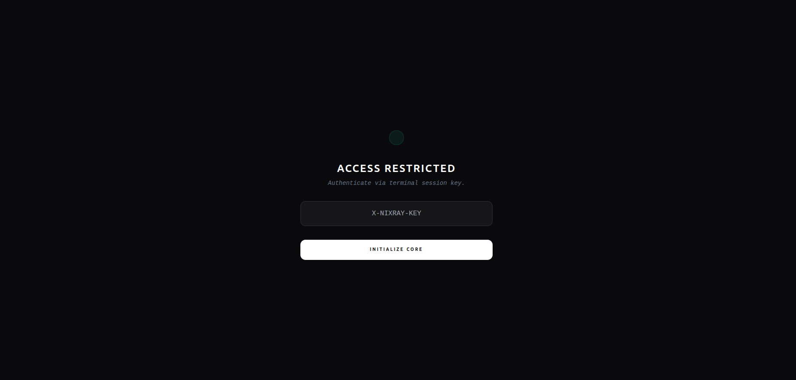
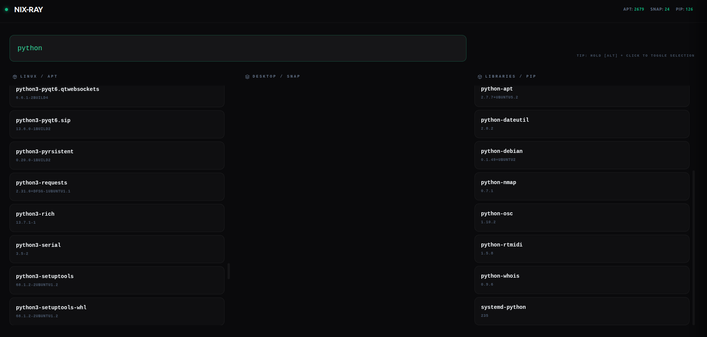

# NIX-RAY 
### [ SYSTEM // HARDENED // MANAGER ]

> **Status:** Operational 🟢  
> **Registry:** RugeroBuilds // Internal  
> **Protocol:** Zero-Footprint System Cleanup

---

## ⚡ The Mission
Linux system maintenance is often a fragmented mess of `apt`, `snap`, and `pip` commands. **NIX-RAY** unifies your system inventory into a single, high-visibility dashboard. It’s built for those who value **surgical precision** over "spray and pray" package management.

No more terminal scrolling. No more accidental deletions. Just pure, emerald-tinted control.

---

## 🖼️ Visual Interface

### 01 // The Handshake (Security Layer)
Every session begins with a unique, 32-character API key generated in your terminal. Without it, the dashboard is a ghost.
<p align="center">
  
</p>

### 02 // The Tactical HUD
A unified view of your entire system. Sort, search, and identify bloat across APT, Snap, and Python environments simultaneously.
<p align="center">
  
</p>

---

## 🛠️ Operational Guide

### 1. Extraction (Installation)
Ensure you have Python 3.12+ installed. Clone the repository to your local machine:

```bash
git clone https://github.com/rugerobuilds/nix-ray.git
cd nix-ray
````

### 2\. Initialization

Run the unified launcher. This will ignite the FastAPI backend and deploy the interface in your default browser.

```bash
python3 launch.py
```

### 3\. The Handshake

1.  Check your **Terminal Output**.
2.  Copy the generated `SESSION KEY`.
3.  Paste it into the browser overlay to unlock the core.

### 4\. Surgical Selection

  * **Search:** Use the global search to filter packages instantly.
  * **Select:** Hold **`[ALT]`** and **Click** on package cards to queue them for removal.
  * **Execute:** Click **`Apply Changes`**, provide your sudo credentials, and watch the logs as NIX-RAY purges the targets.

-----

## 🛡️ Hardened Security

NIX-RAY is designed with a "Security-First" architecture:

  * **Local-Only Binding:** The API strictly binds to `127.0.0.1`, making it invisible to your local network.
  * **Token-Based Auth:** Every refresh generates a new key. Your data never leaves your machine.
  * **Secure Subprocessing:** Sudo commands are piped through controlled streams to prevent shell injection.

-----

## 🤝 Contributing

RugeroBuilds is an open-spec studio. If you want to improve the extraction logic or the UI design:

1.  Fork the repo.
2.  Create your feature branch (`git checkout -b feature/EmeraldUpgrade`).
3.  Commit your changes (`git commit -m 'Add new UI flare'`).
4.  Push to the branch (`git push origin feature/EmeraldUpgrade`).
5.  Open a Pull Request.

---

## 📜 License
Distributed under the **MIT License**. See `LICENSE` for more information.

<br />

<p align="center">
  <b>Built with 💚 by <a href="https://github.com/rugerobuilds">Rugero Tesla</a></b>
</p>
